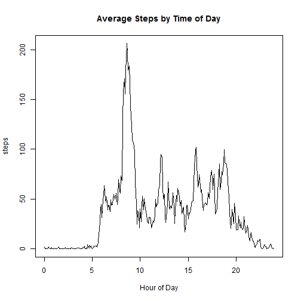

#Peer Assessment 1
for Reproducible Research
Class 5 in the Data Science Specialization on Coursera

Author: Matt Dau
Date Due: Sunday, April 19
========================================================

The purpose of the assignment is to analyze data from a personal activity monitoring device. This device collects data at 5 minute intervals through out the day. The data consists of two months of data from an anonymous individual collected during the months of October and November, 2012 and include the number of steps taken in 5 minute intervals each day.

First we will set the global parameters for the assignment and read the data set used.


```r
library(RCurl)
temp = tempfile()
sourcedata <- getBinaryURL("https://d396qusza40orc.cloudfront.net/repdata%2Fdata%2Factivity.zip", ssl.verifypeer = FALSE)
write(sourcedata, file = temp)
unzip(temp, "activity.csv")
```

```
## Warning in unzip(temp, "activity.csv"): error 1 in extracting from zip
## file
```

```r
data = read.csv("activity.csv")
```

Next we will look at the total number of steps taken by day.


```r
gooddata = na.omit(data)
daymeans = aggregate(gooddata$steps, by = list(gooddata$date)
                     , FUN = sum, na.rm = T)
names(daymeans) = c("date","steps")
daymeans$date = strptime(daymeans$date,"%Y-%m-%d")
hist(daymeans$steps, breaks = length(daymeans$steps)
     , main = "Histogram of Total Steps per Day"
     , xlab = "Steps")
```

 

We can use this to determine the mean and median daily steps
 

```r
mean(daymeans$steps)
```

```
## [1] 10766.19
```

```r
median(daymeans$steps)
```

```
## [1] 10765
```

Next we will look at the average pattern over a day by plotting the mean of all days for each five-minute interval


```r
timemeans = aggregate(gooddata$steps, by = list(gooddata$interval)
                      , FUN = mean, ra.rm = T)
names(timemeans) = c("time", "steps")
library(plyr)
timehours = round_any(timemeans$time, 100, floor)
timemeans$time.decimal = timehours/100 + (timemeans$time - timehours)/60
with(timemeans, plot(time.decimal, steps, type = "l"
                     , main = "Average Steps by Time of Day"
                     , xlab = "Hour of Day"))
```

 

We can use this to determine what hour of the day contains the most steps on average, which we can see is at 8:35 AM.


```r
timemeans$time[which(timemeans$steps == max(timemeans$steps))]
```

```
## [1] 835
```

Next we will devise a method of imputing a reasonable value of steps for dates and times that have missing values.  We will calculate an "index" for each date and time that represents the average at that date or time divided by the overall average.  We can then use that to estimate what the number of steps would be at a particular date and time.


```r
daymeans$index = daymeans$steps/mean(daymeans$steps)
timemeans$index = timemeans$steps/mean(timemeans$steps)
baddata = data[is.na(data$steps),]
baddata$date = strptime(baddata$date,"%Y-%m-%d")
for (i in 1:length(baddata[,1])) {
                if (length(which(daymeans$date == baddata$date[i])) > 0) {
                        x=daymeans$index[which(daymeans$date == baddata$date[i])]
                } else {
                        x = 1
                }
                y = timemeans$index[which(timemeans$time == baddata$interval[i])] 
        baddata$steps[i] = x * y * mean(gooddata$steps)
}
fulldata = rbind(gooddata, baddata)
```

Using this new, complete, data set we will again construct a histogram of total steps taken per day


```r
fulldaymeans = aggregate(fulldata$steps, by = list(fulldata$date)
                     , FUN = sum, na.rm = T)
names(fulldaymeans) = c("date","steps")
fulldaymeans$date = strptime(fulldaymeans$date,"%Y-%m-%d")
hist(fulldaymeans$steps, breaks = length(fulldaymeans$steps)
     , main = "Histogram of Total Steps per Day \n With imputed values for missing data"
     , xlab = "Steps")
```

 

We will again compute the mean and median values to see if adding imputed data changes the results.


```r
mean(fulldaymeans$steps)
```

```
## [1] 10766.19
```

```r
median(fulldaymeans$steps)
```

```
## [1] 10766.19
```

As you can see there is no change in mean value of steps.  However, there is a very slight change in the median value.

In order to compare the daily patterns of weekdays and weekends, we will create a new factor variable to identify the two groups and plot a line chart for each.


```r
fulldata$weekday = weekdays(as.Date(fulldata$date))
weekenddata = subset(fulldata, weekday %in% c("Saturday","Sunday"))
weekdaydata = subset(fulldata, weekday %in% c("Monday","Tuesday","Wednesday"
                                            ,"Thursday","Friday"))
weekendtimemeans = aggregate(weekenddata$steps, by = list(weekenddata$interval)
                      , FUN = mean, ra.rm = T)
names(weekendtimemeans) = c("time", "steps")
weekendtimehours = round_any(weekendtimemeans$time, 100, floor)
weekendtimemeans$time.decimal = weekendtimehours/100 + (weekendtimemeans$time -                                                                         
                                weekendtimehours)/60
weekdaytimemeans = aggregate(weekdaydata$steps, by = list(weekdaydata$interval)
                      , FUN = mean, ra.rm = T)
names(weekdaytimemeans) = c("time", "steps")
weekdaytimehours = round_any(weekdaytimemeans$time, 100, floor)
weekdaytimemeans$time.decimal = weekdaytimehours/100 + (weekdaytimemeans$time - 
                                weekdaytimehours)/60
par(mfrow = c(2,1), mar = c(2,2,2,1))
with(weekdaytimemeans, plot(time.decimal, steps, type = "l", ylim = c(0,250)
                     , main = "Average Steps by Time of Day - Weekdays"
                     , xlab = "Hour of Day"))
with(weekendtimemeans, plot(time.decimal, steps, type = "l", ylim = c(0,250)
                     , main = "Average Steps by Time of Day - Weekends"
                     , xlab = "Hour of Day"))
```

 

As you can see there are some differences in the daily patterns of steps.  On weekends the number does not ramp up as early as it does on weekdays, and it is more spread out throughout the day.


